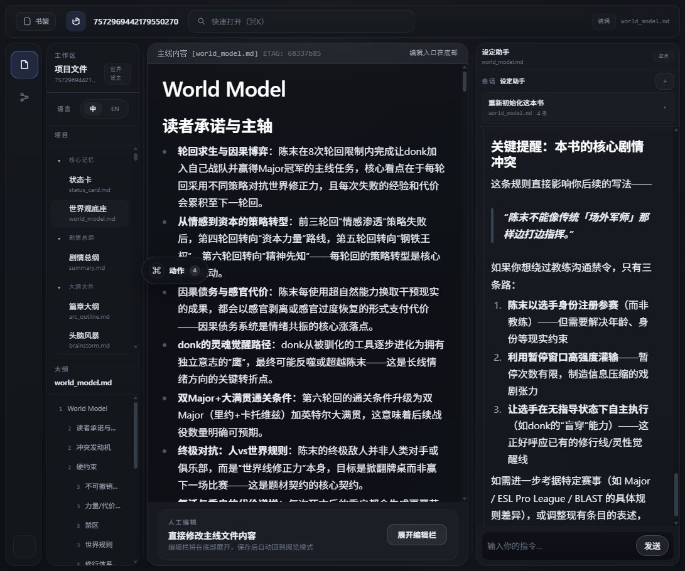
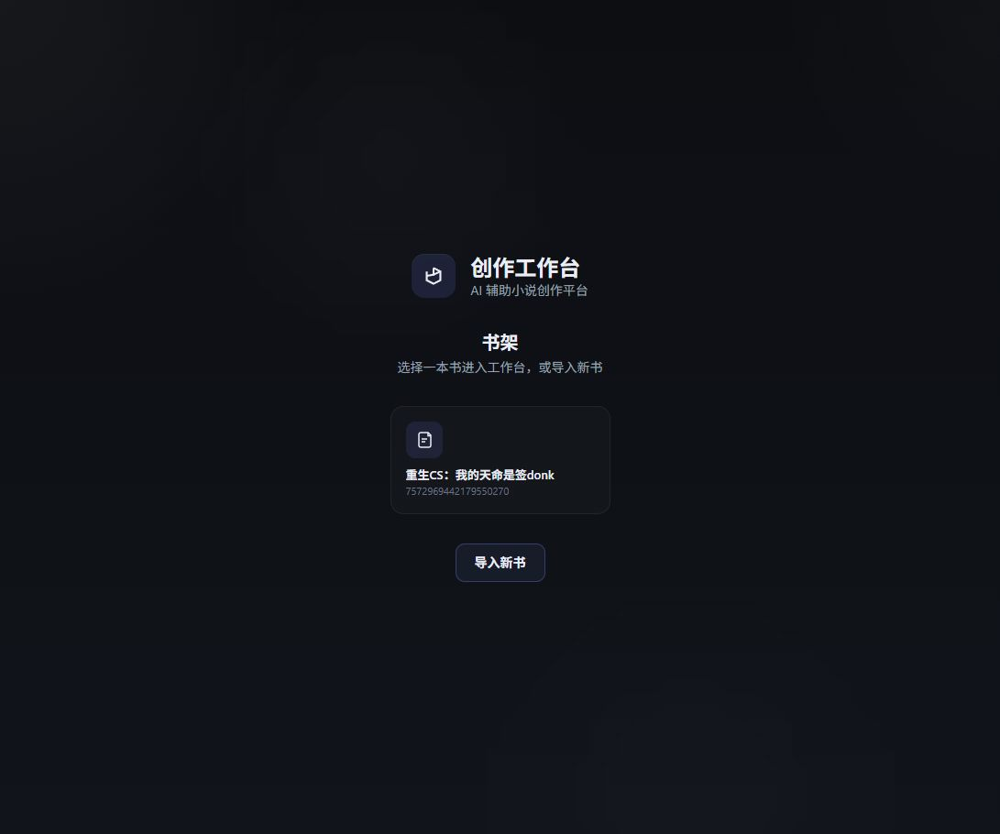
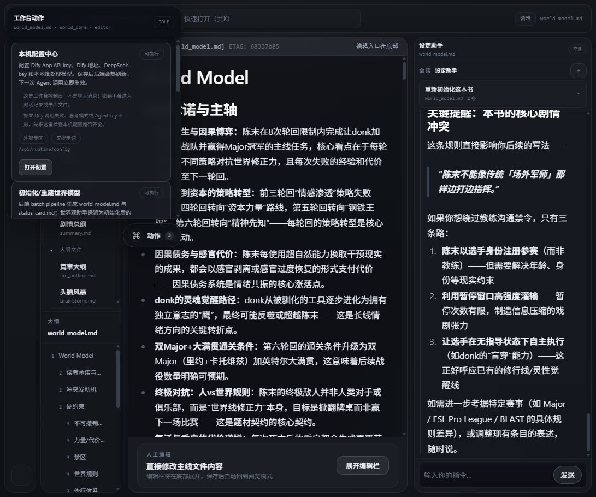
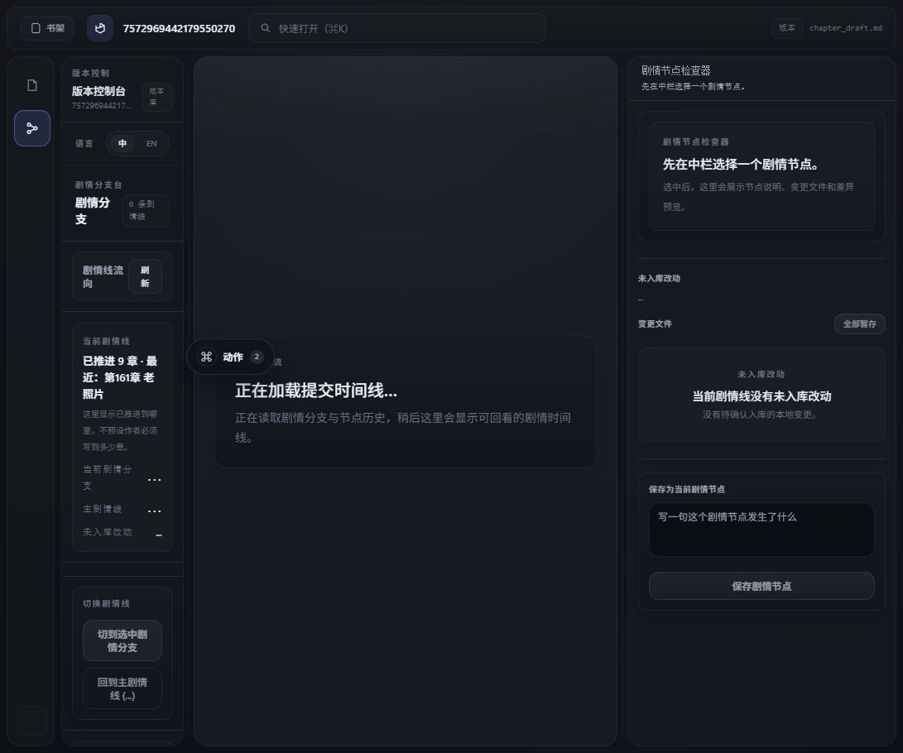
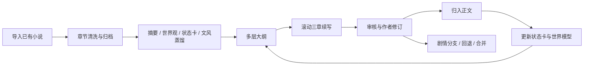
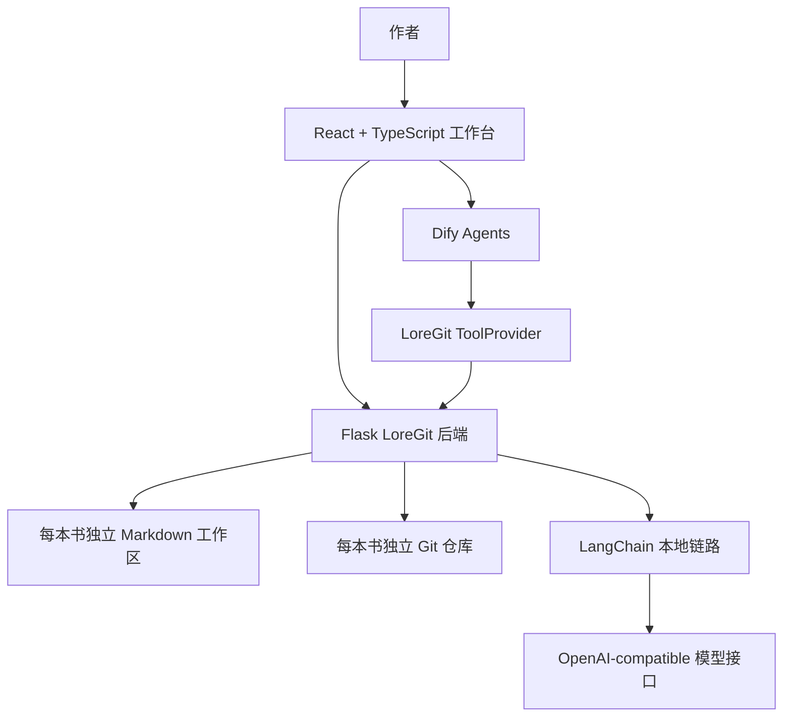

# AI 小说创作工作台

一个面向长篇网文作者的本地 AI 创作工作台：用 Dify Agent 和后端 LangChain 链路协同生成与蒸馏，用 LoreGit 工具层读写书库，用 Git 管剧情分支，用审查工作台控制失控风险。

它不是一个“让模型凭空写小说”的聊天框，而是一个类似 Cursor 的小说创作 IDE。作者可以把已有小说导入为可维护的章节资料库，再把世界观、状态卡、文风指纹、大纲、章节草稿和审查意见沉淀成可回滚、可比较、可分支实验的创作资产。

技术读者可以先看 [HTML 版技术档案](docs/technical-dossier.html) 或 [Markdown 版技术档案](docs/TECHNICAL_DOSSIER.md)，里面更系统地说明 Dify、后端 LangChain、LoreGit ToolProvider、每书 Git 仓库和部署边界的分工。



## 为什么做这个

网文作者真正害怕的往往不是“AI 文风不够像”，而是两件事：

- 剧情失控：越写越多，人物状态、世界观约束、伏笔债务和章节因果开始打架。
- 灵感枯竭：作者需要可以被修改的抓手，而不是一次性、不可追溯的 prompt 输出。
- 试错成本高：一条剧情线写坏后，很难优雅地回退、分叉、比较和合并。

这个项目把 AI 写作从“对话生成”推进到“资产化创作工作流”：模型负责提出草稿和判断依据，作者保留最终审美和剧情选择权。

## 核心能力

- **小说导入与章节归档**：把已有长篇文本清洗为 `chapters/*.md`，建立每本书独立工作区。
- **创作资产蒸馏**：从原文中提取 `summary.md`、`world_model.md`、`status_card.md`、文风档案和多层大纲。
- **滚动三章生产**：逐章消耗章节大纲，批量进入“续写草稿 → 审查 → 正文化归档”的循环。
- **审查与白盒化**：审核 Agent 聚焦剧情连续性、世界观冲突、状态卡更新和可复用问题沉淀；文风作为建议交还作者。
- **Git-native 剧情分支**：每本书是独立 Git 仓库，支持剧情分支、回退、合并和 diff 审阅。
- **Dify DSL 可复现**：当前 6 个 Agent 工作流已导出到 `dify_workflows/`，可导入 Dify 作为模板。

## 截图导览

### 书库与导入

从书架进入作品，或导入新的小说资料。运行时书库数据不提交进源码仓库。



### 多面板创作 IDE

左侧是项目文件和章节资产，中间是可读写 Markdown 工作区，右侧是 Agent 会话、剧情节点和 Git 工作台。


### 工作台动作面板

初始化、补齐、完整重跑、滚动三章生产等“无提示词后台动作”从独立动作面板触发，不混进聊天记录。



### 章节草稿与续写接棒

续写 Agent 只负责写入 `chapter_draft.md`，通过后再归入正文，并触发状态卡、世界模型和草稿清理接棒。


### 审查证据与作者判断

审查链路把冲突、风险和文风建议整理成作者可读证据。文风不再作为卡死 demo 的硬门，而是给作者可修改的判断依据。


### 剧情分支与回退

作者可以新开剧情试写、切换剧情线、合并分支或只回退当前剧情线，让小说创作具备 Git 式试错能力。



## 工作流



## 系统架构



## Dify Agent 与 LangChain 链路

当前仓库包含 6 个净化后的 Dify DSL 快照，但它们的职责状态并不相同：

| DSL | 当前状态 | 当前职责 |
| --- | --- | --- |
| `dify_workflows/世界模型agent.yml` | 保留，初始化/重建职责已退役 | 世界/状态初始化已迁移到后端 LangChain 管线；Dify 世界模型 Agent 负责初始化后的讨论、解释、局部修订和考据 |
| `dify_workflows/文风学习agent.yml` | 保留，初始化/重建职责已退役 | 文风初始化已迁移到后端管线和 LoreGit 诊断；Dify 文风 Agent 负责初始化后的讨论、解释和作者协作修订 |
| `dify_workflows/灵感大纲agent.yml` | 活跃 | 大纲讨论、联网参考、四层大纲落档和章节卡补充 |
| `dify_workflows/续写agent.yml` | 活跃 | 按章节卡和项目档案写入 `chapter_draft.md` |
| `dify_workflows/审核agent.yml` | 活跃 | 审查剧情、设定、状态、断章和正文归档风险，写入 `error_archive.md` |
| `dify_workflows/读书存档agent.yml` | 已退役，仅历史兼容 | `summary.md` 初建/重建已迁移到后端 LangChain 摘要归档管线 |

这些 YAML 可以导入 Dify 复现工作流结构、提示词、节点图和工具引用，但不是完整运行时备份。新环境仍需配置模型供应商、Dify App API Key 和 LoreGit ToolProvider 地址。

项目不是纯 Dify 应用。Dify 主要承载仍活跃的可视化 Agent 工作流和人机协作入口；后端 LangChain 链路已经接管摘要归档、世界/状态初始化、文风初始化、章节卡/摘要结构修复等可重复管线；LoreGit ToolProvider 负责把活跃 Dify Agent 的写入动作落到每本书的 Markdown 工作区和 Git 仓库里。

## 技术栈

- Frontend: React, TypeScript, Vite
- Backend: Flask, Python
- Agent Orchestration: Dify Workflow / Chatbot Agent + LangChain backend chains
- Storage: Markdown files, local filesystem
- Versioning: nested Git repositories per book
- Runtime: local Windows development stack with Docker / Dify

## 如何部署

这个项目目前定位为“可复现的本地 demo + 可展示的工程样例”，不是把所有密钥、Dify 数据库和私有书库都打进包里的黑盒一键应用。推荐路线是：先用 Release ZIP、源码 clone、Docker Compose 本地构建或 GHCR 镜像跑通前后端和书库工作台，再接入自己的 Dify Runtime、模型供应商和 Dify App API Key。

部署说明：项目目前由个人维护，且架构原创性较高，是“本地书库 + Dify Agent 工作流 + 后端 LangChain 链路 + LoreGit 工具层 + 每书 Git 仓库”的混合系统，还没有成熟商业软件那种覆盖所有机器环境的一键部署方案。如果部署过程中遇到端口占用、Docker/WSL、Dify Runtime、模型 Key、ToolProvider 连通性或路径差异问题，建议把报错日志、`deploy/demo/.env` 配置和当前系统环境交给 AI 辅助排查。多数问题可以快速定位到路径、网络、密钥、服务启动顺序或 Dify 到后端的访问地址。

部署边界先说清楚：

- Release ZIP / Compose / GHCR 镜像包含：前端、后端、启动脚本、Dify DSL YAML、部署示例配置和 smoke check。
- Release ZIP / Compose / GHCR 镜像不包含：真实模型密钥、Dify App API Key、Dify 数据库备份、私有书库、`.runtime`、运行时草稿和个人环境文件。
- 活跃 Dify 工作流需要导入后重新配置模型供应商，并生成对应 App 的 API Key；已退役 DSL 可以不导入，只作为历史兼容资料保留。
- Dify 内的 LoreGit ToolProvider 需要能访问本项目 Flask 后端，否则活跃 Dify Agent 会生成文本但无法读写书库文件。

### 路线 A：Release ZIP，本地演示推荐

适合想最快体验项目的人，也适合面试或课堂演示机器。

1. 在 [GitHub Releases](https://github.com/blackzhanzhan/novel_agent/releases) 下载最新的 `novel-agent-demo-v*.zip`。
2. 解压到一个没有中文空格干扰的目录，例如 `D:\demo\novel_agent`。
   Release ZIP 使用跨平台目录路径；在 WSL/Linux 解压后也应能看到 `deploy/demo/.env.example` 和 `docs/DEPLOYMENT.md`。
3. 第一次运行时初始化配置文件：

```powershell
.\start_demo.ps1 -InitEnv
```

4. 打开 `deploy/demo/.env`，至少填写这些字段：

```text
DIFY_BASE_URL=http://localhost/v1
COMPOSE_DIFY_BASE_URL=http://host.docker.internal/v1
DIFY_WORLD_MODEL_API_KEY=
DIFY_STYLE_GUIDE_API_KEY=
DIFY_OUTLINE_API_KEY=
DIFY_CONTINUATION_API_KEY=
DIFY_REVIEW_API_KEY=
DEEPSEEK_API_KEY=
```

5. 启动 demo：

```powershell
.\start_demo.ps1
```

6. 浏览器打开：

```text
http://127.0.0.1:5173/bookshelf.html
```

常用维护命令：

```powershell
.\start_demo.ps1 -Status
.\start_demo.ps1 -Stop
.\start_demo.ps1 -SkipDify
```

`-SkipDify` 适合只改前端或后端 UI 时使用；完整续写、审查、世界观和大纲链路仍然需要 Dify 可访问。

### 路线 B：源码运行，适合开发和二次修改

适合需要改代码、看实现、做简历项目讲解的人。

```powershell
git clone https://github.com/blackzhanzhan/novel_agent.git
cd novel_agent
Copy-Item .\deploy\demo\.env.example .\deploy\demo\.env
```

然后编辑 `deploy/demo/.env`。关键字段含义如下：

| 字段 | 作用 |
| --- | --- |
| `NOVEL_AGENT_DIFY_COMPOSE_DIR` | 本机 Dify compose 目录。Windows 脚本会通过 WSL 或本机路径检查 Dify 状态。 |
| `DIFY_BASE_URL` | 后端调用 Dify Service API 的地址，本机 Dify 常用 `http://localhost/v1`。 |
| `COMPOSE_DIFY_BASE_URL` | Docker Compose 内部访问 Dify 的地址，常用 `http://host.docker.internal/v1`。 |
| `DIFY_*_API_KEY` | 各个 Dify App 的 API Key。推荐每个 Agent 单独填，便于排查。 |
| `DEEPSEEK_BASE_URL` / `DEEPSEEK_MODEL` / `DEEPSEEK_API_KEY` | 后端自有 LangChain 链路使用的 OpenAI-compatible 模型配置。 |
| `BACKEND_HOST_PORT` / `FRONTEND_HOST_PORT` | Docker Compose 暴露到宿主机的端口，默认 `8000` 和 `5173`。容器内部端口固定为后端 `8000`、前端 `5173`，通常不要改。 |

启动：

```powershell
.\deploy\demo\bootstrap.ps1
```

如果只是前端体验，不希望脚本管理 Dify：

```powershell
.\deploy\demo\bootstrap.ps1 -SkipDify
```

### 路线 C：Docker Compose 本地构建，适合隔离验证

适合在新机器上用容器隔离后端、前端、demo storage 和 smoke check。

```powershell
Copy-Item .\deploy\demo\.env.example .\deploy\demo\.env
# 填写 Dify App API Key、模型供应商 Key 和 COMPOSE_DIFY_BASE_URL
docker compose --env-file deploy\demo\.env -f docker-compose.demo.yml up -d --build
docker compose --env-file deploy\demo\.env -f docker-compose.demo.yml run --rm smoke
```

Compose 默认使用隔离卷 `demo-storage` 和 `demo-runtime`，不会挂载宿主机的 `novel_git_server/storage/`。如果宿主机端口冲突，只改 `BACKEND_HOST_PORT` 或 `FRONTEND_HOST_PORT`，容器内部端口保持后端 `8000`、前端 `5173`。

### 路线 D：GHCR 预构建镜像，适合快速拉起

仓库会通过 `.github/workflows/publish-images.yml` 发布前后端镜像到 GitHub Container Registry：

- `ghcr.io/blackzhanzhan/novel_agent-backend:latest`
- `ghcr.io/blackzhanzhan/novel_agent-frontend:latest`

使用预构建镜像：

```powershell
Copy-Item .\deploy\demo\.env.example .\deploy\demo\.env
# 填写 Dify App API Key、模型供应商 Key 和 COMPOSE_DIFY_BASE_URL
docker compose --env-file deploy\demo\.env -f docker-compose.ghcr.yml up -d
docker compose --env-file deploy\demo\.env -f docker-compose.ghcr.yml run --rm smoke
```

如果拉取 GHCR 镜像失败，先确认 GitHub Packages 可见性；公开包一般可以直接拉取，私有包需要 `docker login ghcr.io`。

### Dify 工作流导入

在 Dify 控制台中为需要运行的 YAML 创建或导入 App。文件位于 `dify_workflows/`：

| 文件 | 状态 | 用途 |
| --- | --- | --- |
| `世界模型agent.yml` | 保留，初始化/重建职责已退役 | 后初始化世界观讨论、局部修订、在线考据和约束生命周期整理。 |
| `文风学习agent.yml` | 保留，初始化/重建职责已退役 | 文风档案生成后的讨论、解释、证据诊断和局部修订。 |
| `灵感大纲agent.yml` | 活跃 | 生成人机协作的大纲、章节计划和滚动三章计划。 |
| `续写agent.yml` | 活跃 | 按章节大纲、原文片段和项目档案生成续写草稿。 |
| `审核agent.yml` | 活跃 | 审查剧情冲突、设定冲突、断章和正文归档风险。 |
| `读书存档agent.yml` | 已退役，仅历史兼容 | `summary.md` 初建和重建已迁移到后端 LangChain 摘要归档管线。 |

导入后需要逐项检查：

1. 模型供应商已经配置，例如 DeepSeek 或其他 OpenAI-compatible 服务。
2. 对需要推理的 Agent 开启对应模型的思考能力；不需要思考的归档类 Agent 可以关闭。
3. 每个 App 生成 API Key，并写入 `deploy/demo/.env`。
4. LoreGit ToolProvider 指向本项目后端，例如本机 `http://host.docker.internal:8000` 或局域网可访问地址。
5. 在 Dify 控制台单独运行一次需要启用的活跃 App，确认不会因为模型、工具或变量缺失失败。

### 验证部署

最小验收路径：

1. 打开 `http://127.0.0.1:5173/bookshelf.html`，确认书架页面可见。
2. 进入一本书，确认正文、世界观、文风、大纲、草稿等文件可以切换查看。
3. 打开右下角“动作”面板，确认初始化、重跑、滚动三章、正文归档入口可见。
4. 打开配置入口，确认 Dify Base URL、活跃 Agent API Key 和后端 LangChain 模型配置已经保存。
5. 运行一次文风或世界观初始化，确认后端能写入书库文件。
6. 运行一次章节续写或滚动三章，确认草稿生成后可以进入审核和正文归档。
7. 正文归档后确认章节文件、状态卡和必要世界观更新被写入，并且草稿不会无限膨胀。

后端健康检查：

```powershell
Invoke-WebRequest http://127.0.0.1:8000/health
```

Compose smoke check：

```powershell
docker compose --env-file deploy\demo\.env -f docker-compose.demo.yml run --rm smoke
```

### 常见问题

| 现象 | 排查方向 |
| --- | --- |
| 前端能打开，但 Dify 调用失败 | 检查 `DIFY_BASE_URL`、对应 `DIFY_*_API_KEY` 和 Dify App 是否发布。 |
| Dify 能生成回答，但不能读写书库 | 检查 LoreGit ToolProvider 是否指向后端，容器里通常用 `http://host.docker.internal:8000`。 |
| Compose smoke 失败 | 检查 `COMPOSE_DIFY_BASE_URL` 是否是容器内可访问的 Dify 地址。 |
| 端口被占用 | Docker Compose 修改 `BACKEND_HOST_PORT` 或 `FRONTEND_HOST_PORT`；PowerShell 启动脚本使用 `-BackendPort` 或 `-FrontendPort` 参数。 |
| GHCR 拉取失败 | 检查包是否公开，必要时执行 `docker login ghcr.io`。 |
| Dify YAML 导入后没有模型 | 这是正常现象，需要在你的 Dify 环境中重新选择模型供应商和模型。 |

更完整的部署边界、Dify runtime 规则和 smoke check 标准见 `docs/DEPLOYMENT.md`。

## 目录概览

```text
frontend/              # React 创作工作台
novel_git_server/      # Flask API、书库协议、Dify 工具桥
dify_workflows/        # 当前导出的 Dify 工作流 DSL
deploy/demo/           # 本地 demo 启动与容器化脚本
scripts/               # 本地启动、Dify patch、导出和验证脚本
tools/                 # 辅助维护工具
docs/                  # 演示、架构、部署和收口文档
prd.md                 # 历史 PRD 与产品蓝图
```

运行数据位于 `novel_git_server/storage/`，不会作为源码提交。

## 项目状态

项目处于本地 demo 收口阶段，已经具备前后端工作台、Dify 工具桥、小说导入、后端 LangChain 摘要/世界/文风初始化管线、活跃大纲/续写/审核 Agent 主链路，以及剧情分支/回退的核心能力。`读书存档agent` 已退役，世界模型和文风 Agent 的初始化/重建职责也已迁移到后端管线。

推荐阅读：

1. `docs/DEMO_SCRIPT.md`
2. `docs/ARCHITECTURE.md`
3. `docs/DEPLOYMENT.md`
4. `docs/DIFY_PROMPT_INVENTORY.md`
5. `docs/ROLLING_CHAPTER_WORKFLOW_CASE.md`
