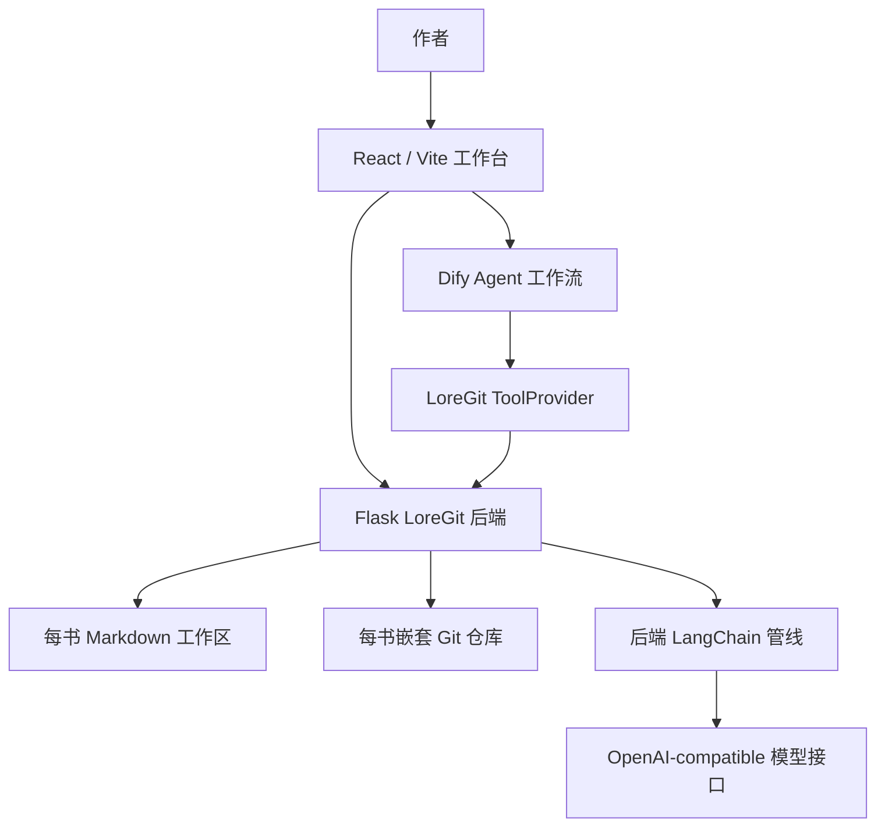
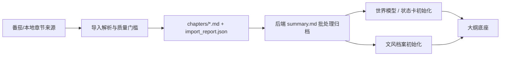

# Technical Dossier: AI 小说创作工作台

这是一套面向长篇网文创作的本地优先工作台：它把已有小说导入为每书独立的 Markdown 资料库，用 Dify Agent 做可视化语义工作流，用后端 LangChain 管线做可测试的本地批处理和模型兼容调用，用 LoreGit ToolProvider 把 Agent 写入动作约束到本地文件与 Git 历史中。

## 一句话定义

`novel_agent` 不是普通聊天式写作工具，而是一个小说创作 IDE：作者把作品维护成可读写、可审阅、可分支、可回滚的工程资产，再让 Agent 在明确文件边界内协助导入、蒸馏、大纲、续写、审查和归档。

## 解决的问题

长篇网文创作的核心风险不是单次生成质量，而是长期失控：

- 原文、摘要、世界观、状态卡、文风档案、大纲和草稿分散在聊天上下文里，无法长期维护。
- 作者想试两条剧情路线时，经常只能复制文件或另开文档，难以比较、回退和合并。
- Agent 写作容易把“生成文本”当成全部工作，缺少章节归档、审查证据、状态更新和错误沉淀。
- 当系统部署到另一台机器时，Dify、模型密钥、本地文件、Docker 和后端服务之间的边界容易混在一起。

本项目的设计是把这些内容拆成稳定职责：语义判断交给 Agent，确定性文件和 Git 操作交给后端，运行数据落在每本书自己的工作区，最终取舍保留给作者。

## 不是什么

这个项目容易被误归类，需要先排除几个常见误解：

- 不是纯 Dify 应用。Dify 承载可视化 Agent 工作流，但本地书库、Git 分支、确定性导入、审阅台和 LangChain 批处理都在项目后端与前端中。
- 不是一个聊天壳。聊天面板只是 Agent 交互入口，初始化、重跑、滚动三章、正文归档、配置中心和 Git 操作都属于工作台动作层。
- 不是通用 Agent 框架。它是面向小说资料库和章节生产的产品化工作流。
- 不是成熟云端 SaaS。一键部署和云端多租户不是当前目标；当前目标是可复现的本地 demo 和可展示的工程样例。
- 不是把私有 Dify 数据库或真实书库打包发布。公开仓库只包含源码、导出的 Dify DSL、示例配置、文档和演示脚本。

## 架构总览



核心分工如下：

| 层级 | 职责 | 典型文件 |
| --- | --- | --- |
| 前端工作台 | 书架、导入、文件浏览、聊天、动作面板、审阅台、Git 分支台、配置入口 | `frontend/src/App.tsx`, `frontend/src/bookshelf/BookshelfApp.tsx`, `frontend/src/components/*` |
| Flask 后端 | 统一 API、路径安全、书库布局、Git 操作、Dify 桥接、SSE 进度、运行配置 | `novel_git_server/app.py`, `novel_git_server/agents/*.py`, `novel_git_server/utils/*.py` |
| Dify 工作流 | 世界模型、文风、大纲、续写、审核等语义 Agent 编排 | `dify_workflows/*.yml` |
| 后端 LangChain 管线 | 摘要归档、世界/状态初始化、文风初始化、结构化批处理和 OpenAI-compatible 调用 | `novel_git_server/pipelines/*.py` |
| LoreGit ToolProvider | 让 Dify Agent 以受控工具方式读写书库、校验章节、提交草稿 | `novel_git_server/agents/tools.py`, `novel_git_server/docs/openapi_v3_5_1_draft_min.json` |
| 每书工作区 | 章节、知识文件、草稿、导入报告、嵌套 Git 历史 | `novel_git_server/storage/<book_id>/` |

## 运行时权威

项目有三个层面的“谁说了算”：

1. 书籍内容权威：`novel_git_server/storage/<book_id>/`
   - `chapters/*.md` 是正式章节。
   - `summary.md`、`world_model.md`、`status_card.md`、文风文件和大纲文件是可维护的创作知识。
   - `chapter_draft.md` 是当前续写草稿和审阅面。
   - 每本书内部有自己的 `.git/`，剧情分支和回退基于这个嵌套仓库。

2. 运行配置权威：本地忽略文件和配置接口
   - Dify Base URL、各 Agent API Key、模型供应商 Key、DeepSeek/OpenAI-compatible 配置属于本机运行配置。
   - 这些配置不进入 Git，不写入聊天记录，也不写入书库。

3. Dify 运行时权威：Dify PostgreSQL 与插件存储
   - `dify_workflows/*.yml` 是净化后的 DSL 快照，能作为导入模板和配置证据。
   - 真实运行时仍需要 Dify 中的 App、模型供应商、工具提供者、插件包和 API Key。

这三个权威不能混淆：源码仓库不包含真实书库、密钥或完整 Dify 数据库；Dify 工作流也不直接拥有本地文件系统，必须通过 LoreGit 工具层落盘。

## 关键数据对象

每本书的典型工作区如下：

```text
novel_git_server/storage/<book_id>/
├── .git/
├── metadata.json
├── chapters/
├── summary.md
├── world_model.md
├── status_card.md
├── domain_rules.md
├── style_fingerprint.md
├── style_review.md
├── style_constraints_for_continuation.md
├── style_guide.md
├── brainstorm.md
├── master_outline.md
├── arc_outline.md
├── chapter_outline.md
├── chapter_draft.md
├── error_archive.md
└── import_report.json
```

几个关键语义边界：

- `summary.md` 是从正式章节派生的阅读档案，当前由后端摘要归档管线生成和重建。
- `world_model.md` 是长期世界规则和约束，`status_card.md` 是当前章节后的状态投影。
- 四个大纲文件不是同义重复：`brainstorm.md` 管灵感池，`master_outline.md` 管长线读者承诺，`arc_outline.md` 管篇章留存单元，`chapter_outline.md` 管可执行章节卡。
- `chapter_draft.md` 是续写 Agent 的草稿目标，不是正式章节；只有作者确认后才会正文化归档进 `chapters/*.md`。
- `error_archive.md` 存放可复用审查问题和风险沉淀，不是普通聊天记录。

## 主要运行流

### 导入与初始化



导入器做确定性清洗，不改写原文。摘要、世界/状态和文风初始化已经逐步退到后端 promptless 管线，因为这些任务更像可重复批处理，不适合藏在聊天指令里。

### 大纲到续写


续写的关键设计不是“让模型自由写”，而是让它消费可执行章节卡，在世界观、状态卡、摘要、文风提示和错误档案约束下写入草稿。审查和归档发生在草稿之后，作者仍是最终裁决者。

### 滚动三章生产

滚动生产层是控制器，不写小说正文。它根据 `chapters/*.md` 推断已接受进度，根据 `chapter_draft.md` 推断待审草稿，根据 `chapter_outline.md` 选择下一批章节卡，然后触发现有续写工作流。卡不够时，它提示补纲；卡格式不对时，它提示修复章节卡。

相关代码：

- `novel_git_server/pipelines/rolling_chapter.py`
- `novel_git_server/agents/rolling.py`
- `frontend/src/components/WorkbenchActionDock.tsx`
- `frontend/src/api/orchestration.ts`

### 剧情分支与回退

每本书是独立 Git 仓库，因此剧情路线可以成为真实分支，而不是复制文件夹。作者可以：

- 新开剧情试写分支。
- 只查看某个分支历史，不切换当前工作树。
- 切换到某条剧情线继续生产。
- 合并分支，或对当前分支做硬回退。
- 在审阅台查看多文件 diff。

相关代码：

- `novel_git_server/agents/git_console.py`
- `frontend/src/components/GitBranchPanel.tsx`
- `frontend/src/components/GitCenterPanel.tsx`
- `frontend/src/components/GitWorkingTreePanel.tsx`
- `frontend/src/components/GitDiffFullscreen.tsx`

## Dify 与 LangChain 的分工

项目采用混合架构，不是二选一。

| 能力 | 主要承载层 | 原因 |
| --- | --- | --- |
| 互动式世界观讨论、局部修正 | Dify Agent | 需要多轮语义判断和工具调用 |
| 大纲头脑风暴与落档 | Dify Agent + LoreGit 工具 | 需要作者讨论，也需要受控写入 |
| 续写章节草稿 | Dify continuation Agent | 需要长上下文、写作能力和工具校验 |
| 审核剧情冲突 | Dify review Agent | 需要语义审查和证据解释 |
| 摘要归档初始化/重建 | 后端 LangChain 管线 | 需要批处理、结构化校验、确定性渲染和进度状态 |
| 世界/状态初始化 | 后端 LangChain 管线 | 初始抽取更像固定批处理，不应藏在聊天里 |
| 文风档案初始化 | 后端管线 + LoreGit 诊断 | 需要可重复诊断和多文件一起提交 |
| 文件读写、Git 提交、diff、回退 | Flask + LoreGit | 必须确定、可测试、可审计 |

这也是项目原创性的主要来源：Dify 不是唯一运行时，LangChain 也不是唯一编排层；两者都通过本地书库和 LoreGit 工具层汇合。

## 核心代码地图

| 路径 | 负责什么 | 不要误解成 |
| --- | --- | --- |
| `frontend/src/App.tsx` | 主工作台装配：文件视图、Agent 面板、审阅台、Git 工作台、动作入口 | 不是业务规则权威 |
| `frontend/src/bookshelf/BookshelfApp.tsx` | 书架、导入、配置入口和书籍管理 | 不是章节解析器 |
| `frontend/src/store/index.ts` | 前端会话状态、选中文件、Git 工作台状态、运行中任务状态 | 不是持久化数据库 |
| `frontend/src/api/*.ts` | 前端到 Flask 的 API 客户端 | 不是直接文件 IO |
| `novel_git_server/app.py` | Flask app 和 blueprint 注册，统一健康检查和运行配置装配 | 不是单体业务文件 |
| `novel_git_server/agents/library.py` | 书库列表、初始化、删除和元数据 | 不是 Dify Agent |
| `novel_git_server/agents/tomato_import.py` | 番茄/本地章节导入 API 和导入状态 | 不负责续写 |
| `novel_git_server/agents/world_draft.py` | Dify Agent 流式桥接、文件路由和草稿写入流程 | 不直接拥有所有世界模型初始化 |
| `novel_git_server/agents/tools.py` | 暴露给 Dify 的 LoreGit 工具接口 | 不做自由文本生成 |
| `novel_git_server/agents/git_console.py` | 每书 Git 状态、分支、历史、diff、提交、回退 | 不判断剧情好坏 |
| `novel_git_server/agents/rolling.py` | 滚动生产 API 控制层 | 不写章节正文 |
| `novel_git_server/pipelines/summary_archive.py` | 摘要归档批处理与确定性渲染 | 不是聊天式读书 Agent |
| `novel_git_server/pipelines/world_model_init.py` | 世界/状态初始化批处理 | 不是互动世界观 Agent |
| `novel_git_server/pipelines/style_artifact_init.py` | 文风初始化和诊断文件生成 | 不是文风硬门 |
| `novel_git_server/pipelines/batch_parser.py` | 批处理结构化解析辅助 | 不是最终 Markdown 权威 |
| `dify_workflows/*.yml` | Dify DSL 快照和导入模板 | 不是完整 Dify 运行时备份 |
| `deploy/demo/*` | 本地 demo 和 Compose 复现脚本 | 不是通用云部署平台 |

## 关键调用链

### 书籍导入

```text
BookshelfApp
  -> frontend/src/api/tomatoImport.ts
  -> /books/tomato/*
  -> novel_git_server/agents/tomato_import.py
  -> book_storage / import_report / chapters/*.md
  -> summary_archive pipeline
  -> nested Git commit
```

### Agent 写入草稿

```text
ChatPanel / world_draft route
  -> /api/world/deduce_stream
  -> Dify Service API
  -> LoreGit ToolProvider
  -> /tools/* Flask endpoint
  -> draft/sandbox write
  -> review workspace / diff
```

### 摘要初始化或重建

```text
Workbench action
  -> summary API
  -> summary_archive pipeline
  -> batch_parser structured extraction
  -> deterministic Markdown rendering
  -> summary.md + metadata update
  -> nested Git commit
```

### 正文化归档

```text
Review acceptance
  -> /api/draft/confirm
  -> split accepted chapter_draft.md sections
  -> chapters/*.md
  -> reset chapter_draft.md
  -> refresh summary/status bridge when configured
  -> nested Git commit
```

### 剧情分支查看和切换

```text
GitBranchPanel
  -> fetchGitHistoryList(ref)
  -> /books/git_history_list?ref=...
  -> git log <ref>
  -> timeline view

explicit checkout button
  -> /books/git_checkout
  -> hard dirty/draft guard
  -> actual branch switch
```

## 测试与证据

项目测试以 Flask 后端单元/集成测试和前端构建为主。代表性测试文件：

- `novel_git_server/tests/test_v53_git_console.py`：Git 分支、历史、diff、回退、保护逻辑。
- `novel_git_server/tests/test_v62_markdown_section_write.py`：Markdown 区块写入、草稿写入预算和安全边界。
- `novel_git_server/tests/test_v70_rolling_workbench_api.py`：滚动生产工作台状态。
- `novel_git_server/tests/test_v72_summary_archive_pipeline.py`：摘要归档管线。
- `novel_git_server/tests/test_v73_runtime_config.py`：本地运行配置。
- `novel_git_server/tests/test_v74_openai_compatible_config.py`：OpenAI-compatible 模型配置。
- `novel_git_server/tests/test_v76_summary_batch_parser_cn.py`：中文摘要批处理结构。
- `frontend/package.json` 的 `npm run build`：TypeScript 与 Vite 构建。
- `deploy/demo/compose_smoke.py`：Compose demo 的后端、前端和可选 Dify smoke。

最近用于文档前置检查的命令包括：

```powershell
npm run build
python -m unittest novel_git_server.tests.test_v53_git_console -v
python -m unittest novel_git_server.tests.test_v62_markdown_section_write -v
git diff --check
```

技术档案本身不声称所有链路已经达到云端生产级，只说明目前仓库中可被代码、测试、文档和截图证明的边界。

## 部署与运维边界

当前部署目标是本地可复现 demo：

- Windows 本地启动：`deploy/demo/bootstrap.ps1` 和根目录启动脚本。
- Compose demo：`docker-compose.demo.yml`。
- GHCR 镜像：用于替代本地 build 步骤，但仍需要外部或已配置的 Dify Runtime。
- Release ZIP：源码、Dify DSL 快照、示例配置、启动脚本和 smoke check。

部署不包含：

- 真实模型密钥。
- Dify App API Key。
- 私有 Dify PostgreSQL 备份。
- 私有书库和运行时草稿。
- `.runtime/` 和 `novel_git_server/storage/`。

如果部署失败，优先收集：

- 启动命令和终端日志。
- `deploy/demo/.env` 中的非敏感配置结构。
- Docker/WSL 状态。
- Dify 是否可访问。
- Dify 到 Flask 后端的 ToolProvider 地址。
- 后端 `/health` 和前端 `bookshelf.html` 是否可访问。

由于项目由个人维护且架构原创性较高，建议使用 AI 辅助排查部署问题。多数问题集中在端口、路径、密钥、服务启动顺序、Dify 容器访问宿主机地址这几类。

## 发布边界

公开仓库可以发布：

- 源码。
- 前后端代码。
- 后端 LangChain 管线代码。
- Dify DSL YAML 快照。
- 文档、截图、演示脚本。
- 示例配置。
- smoke check。

公开仓库不能发布：

- 模型 API Key。
- Dify App API Key。
- Dify 数据库私有备份。
- 真实用户书库。
- `novel_git_server/storage/`。
- `.runtime/`。
- 私有聊天、登录态、Cookie 或本地绝对路径。

## 技术读者常见问题

### 为什么不用纯 Dify？

纯 Dify 很适合可视化 Agent 编排，但很难安全承载每书本地 Git 仓库、文件 diff 审阅、正文归档、导入质量门槛、分支回退和本地配置中心。本项目把 Dify 放在语义编排层，确定性 IO 和版本历史放到 Flask/LoreGit 层。

### 为什么还要 LangChain？

摘要归档、世界/状态初始化、文风初始化等任务更像可重复批处理：需要分批、结构化校验、确定性渲染、进度状态和 OpenAI-compatible 配置。把这些放在后端 LangChain 管线里，比塞进聊天指令更容易测试和复现。

### 每本书为什么要独立 Git 仓库？

小说创作需要试错。独立 Git 仓库让每本书都能创建剧情分支、查看历史、比较 diff、回退当前剧情线，而不会污染源码仓库或其他书。

### Agent 能不能直接改正文？

续写 Agent 写 `chapter_draft.md`，不是直接写正式章节。正式章节归档需要作者确认，通过后端正文化流程拆分并写入 `chapters/*.md`。

### 文风是不是硬门？

当前文风更多是提示和审查证据，不再默认卡死 demo。作者可以亲自修改文风档案，续写 Agent 会读取这些提示和最新原文参考，但最终文风权力交还作者。

### Dify DSL 是不是完整备份？

不是。DSL 是工作流结构和提示词快照，可以导入 Dify 作为模板；完整运行还需要 Dify Runtime、模型供应商、插件包、ToolProvider 地址和 App API Key。

## 继续阅读

- [README](../README.md)：项目首页、截图和快速部署。
- [架构总览](ARCHITECTURE.md)：React、Flask、Dify、Markdown 和 Git 的职责说明。
- [部署说明](DEPLOYMENT.md)：Release、Compose、Dify Runtime 和 smoke check 边界。
- [Demo 脚本](DEMO_SCRIPT.md)：录屏和演示叙事。
- [Dify 持久化与备份](DIFY_PERSISTENCE_AND_BACKUP.md)：Dify PostgreSQL 和插件存储的恢复边界。
- [文档地图](DOCUMENT_MAP.md)：公开文档阅读顺序。
